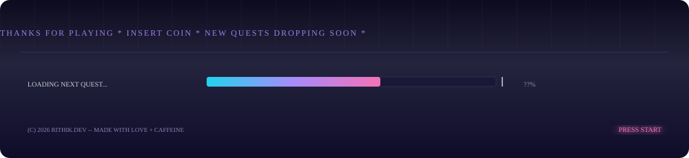

<!--
  RITHIK.DEV profile — arcade edition
  • assets/*.svg are self-hosted, animated SVGs with embedded fonts
    (Bungee + Press Start 2P, both SIL OFL — subsetted & base64'd, no CDN).
  • Animations use SMIL, so they run everywhere GitHub shows this file.
  • Push the `assets/` folder next to this README for the images to resolve.
-->

---

## ⌁ PLAYER FILE

---

## ⌁ SKILL TREE

---

## ⌁ ACHIEVEMENTS

---

## 🛰️ LIVE TELEMETRY — REAL TIME CARDS

---

## ⌁ PARTY INVITES

      

---

## ⌁ LOADOUT

**LANGUAGES**
      

**FRONTEND**
  

**BACKEND & DATA**
    

**OPS & TOOLING**
    

**DESIGN & VIDEO**
   

**HARDWARE**
 

**OFF-DUTY**
 

---

## ⌁ FEATURED QUEST

### [Student_Management_System-using-Data-Structure](https://github.com/Rithik-HyperLoop69/Student_Management_System-using-Data-Structure)
*Built with RAW C & optimized data structures*

---

## ⌁ WORLD MAP (contributions)

<picture>
  <source media="(prefers-color-scheme: dark)" srcset="https://raw.githubusercontent.com/Rithik-HyperLoop69/Rithik-HyperLoop69/output/github-contribution-grid-snake-dark.svg">
  <source media="(prefers-color-scheme: light)" srcset="https://raw.githubusercontent.com/Rithik-HyperLoop69/Rithik-HyperLoop69/output/github-contribution-grid-snake.svg">
  
</picture>

---

